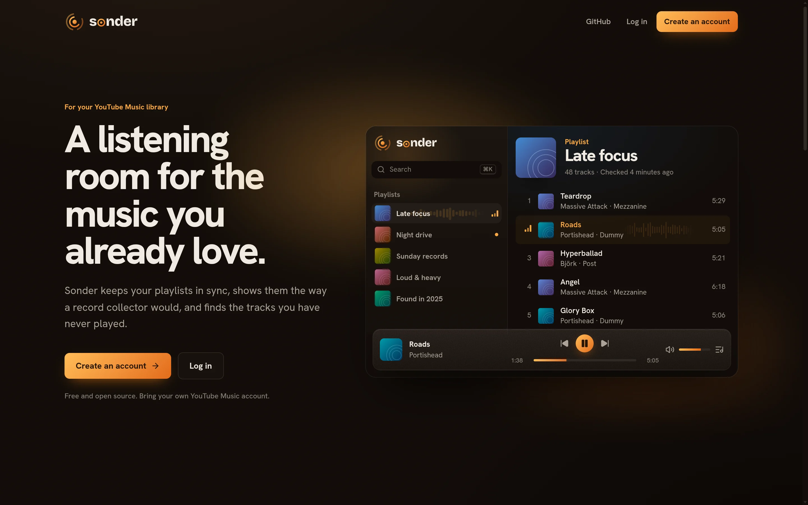
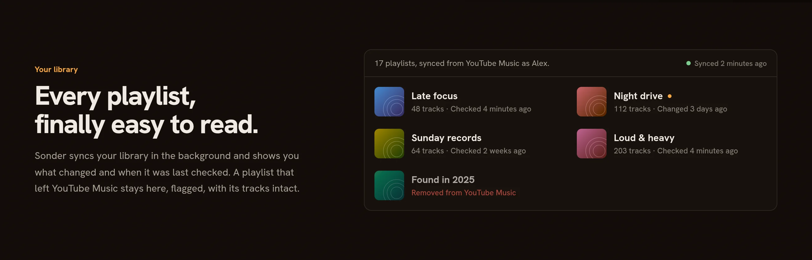
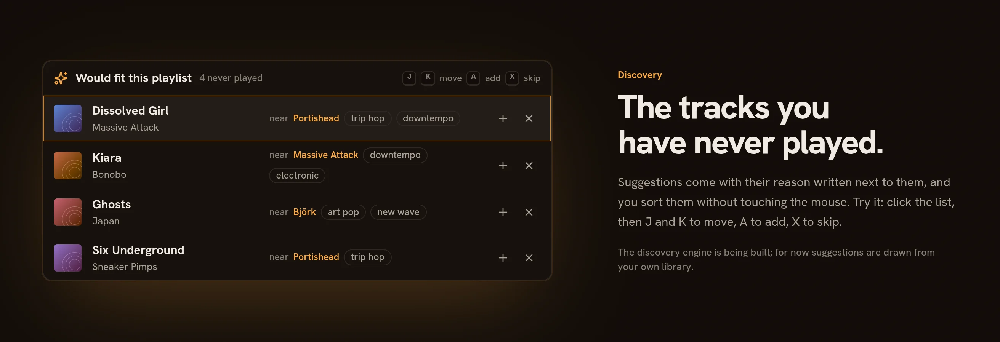
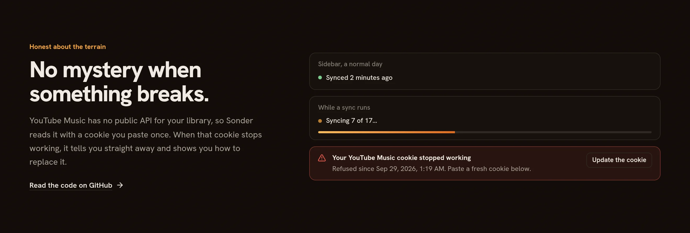
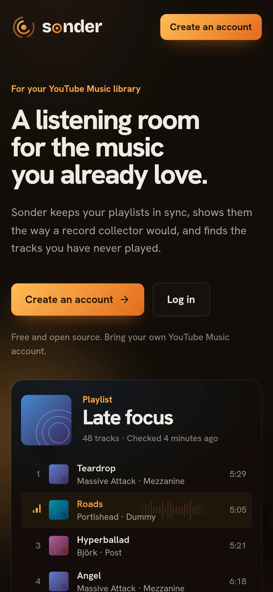

# Sonder

<p align="center">
  
</p>

A self-hosted companion for YouTube Music, built to solve one problem: running
out of new music to listen to while working.

The long-term goal is an engine that finds tracks worth hearing and writes them
into playlists you actually open. **Today, none of that exists.** What exists is
the foundation it needs: a working connection to YouTube Music, and a browsable
view of your library.

Read [Status](#status) before assuming a feature works.

---

## A look around

<p align="center">
  
</p>

<p align="center">
  
</p>

<table>
  <tr>
    <td width="68%"></td>
    <td width="32%"></td>
  </tr>
</table>

The design system behind it, "The Listening Room", is described in
[`DESIGN.md`](DESIGN.md).

---

## Status

Sonder is a proof of concept. This is the whole of it:

| | |
| --- | --- |
| Connect a YouTube Music account | Working |
| Browse your playlists | Working |
| Open a playlist and see its tracks | Working |
| Sync the library into a database, in the background | Working |
| French and English interface | Working |
| Discover new music | Preview: suggestions are sampled from your own library |
| Generate playlists | Not built |
| Moods and themes | Not built |
| Control your player | Preview: playback is simulated |

Playlists and tracks are stored locally and kept fresh by a background sync,
which compares a fingerprint of each playlist so unchanged ones are not
downloaded again.

---

## Constraints you should understand first

These are properties of the terrain, not defects to be fixed later.

**There is no official YouTube Music API.** Google does not publish one. The
YouTube Data API v3 exists but cannot do this job: search is capped at 100 calls
per day, listening history is not exposed at all, and adding tracks costs 50
quota units each against a 10,000/day budget. Sonder therefore goes through
[`ytmusicapi/ytmusicapi`](https://github.com/theyak/ytmusicapi-php), which drives
the private `youtubei/v1` endpoints that the YouTube Music web client uses.

**This means Google can break Sonder at any time**, without warning or notice,
by reshaping a response payload. That is a normal Tuesday, not an emergency.

**Authentication is a pasted browser cookie.** OAuth is not supported — the
upstream package documents that it could not be made to work. You copy your
`cookie` request header out of the developer tools and paste it into Sonder. It
is stored encrypted, and it expires after a few weeks, at which point you paste a
fresh one.

**Run it on a residential connection.** Requests from datacenter IP ranges (AWS,
Vercel, DigitalOcean, Linode, and friends) are frequently refused. Sonder is
designed to run on your own machine.

**It is single-user by design.** One person, one YouTube Music account. Opening
it up to arbitrary users would force the official API and its quotas, which would
defeat the point.

---

## Requirements

- PHP 8.5 with the `sqlite3` extension
- Composer
- [Bun](https://bun.sh)
- A YouTube Music account

---

## Installation

```bash
git clone <your-remote> sonder
cd sonder
composer setup
```

`composer setup` installs dependencies, creates `.env`, generates the app key,
runs migrations, generates the TypeScript definitions and builds the frontend.

Then start the development server:

```bash
composer dev
```

This runs the PHP server, the queue worker, the log tailer, the TypeScript
definition watcher and Vite together. The app is at `http://localhost:8000`.

To run under Octane and FrankenPHP instead:

```bash
composer devWithOctane
```

---

## Connecting your account

1. Register an account in Sonder and sign in.
2. Go to **YouTube Music** in the sidebar.
3. Open <https://music.youtube.com> in your browser, signed in.
4. Open the developer tools, select the **Network** tab, reload the page, and
   click any request to `music.youtube.com`.
5. Under **Request Headers**, copy the entire value of the `cookie` header.
6. Paste it into Sonder and submit.

The cookie must contain `__Secure-3PAPISID`, `SAPISID` and `SID`. Sonder verifies
it against YouTube Music before saving, so you find out immediately if it is
wrong rather than on some later page.

---

## How it is put together

```
app/
├── Data/                          Typed payloads, also the source of the
│   ├── AccountData.php            TypeScript definitions consumed by Vue
│   ├── PlaylistData.php
│   ├── PlaylistSummaryData.php
│   └── TrackData.php
├── Services/YouTubeMusic/
│   ├── Client.php                 The seam: what Sonder needs from YouTube Music
│   ├── YtmusicapiClient.php       The only code that touches the network
│   ├── CachedClient.php           Decorator; content-addressed cache keys
│   └── PayloadMapper.php          Untyped payload -> typed data
├── Actions/                       ConnectYouTubeMusicAccount, Disconnect…
├── Http/Controllers/              PlaylistController, YouTubeMusicConnection…
└── Exceptions/YouTubeMusicException.php
```

Four decisions worth knowing about before you change anything here.

**`Client` is an interface, and that is not ceremony.** The package behind it has
a single maintainer and has previously gone eleven months without tracking
upstream. Keeping every caller behind this interface means the implementation can
be swapped — for a fork, or for a Python sidecar running the original
`ytmusicapi` — without touching a single call site.

**Reading the payload is separated from fetching it.** `PayloadMapper` is pure:
untyped object in, typed data out, no network. That split exists because payload
parsing is the part Google breaks, so it is the part that has to be testable.
Every field is treated as optional; a missing one means YouTube changed
something, not that the caller did anything wrong.

**Cache keys embed the track count.** Loading a large playlist costs a chain of
sequential continuation requests. Rather than expire playlists on a timer and
hope, the key for a playlist's tracks contains its track count, so a playlist
that gained or lost a track lands on a different key and the stale entry is
simply never read again. There is no invalidation logic to get wrong. The count
is scraped out of a subtitle string and is often absent, so when it is unknown
the key cannot detect change and a short TTL is used instead.

**Tests can never reach YouTube Music.** A fake client is bound in `TestCase` for
the whole suite. This is load-bearing: the underlying package ships its own HTTP
layer and never touches Laravel's client, so `Http::preventStrayRequests()`
cannot catch a call that escapes.

---

## Development

```bash
composer dev           # server + queue + logs + type generation + vite
composer test          # type coverage, tests, linters, static analysis
composer lint          # rector + pint + frontend formatter
vendor/bin/pest        # tests only
```

TypeScript definitions are generated from the `App\Data` classes:

```bash
php artisan typescript:transform
```

The output lands in `resources/js/types/generated.d.ts` and is available to Vue
as `App.Data.PlaylistData` and friends. `composer dev` regenerates it on change.
Do not edit it by hand, and do not hand-write matching interfaces in Vue.

Project conventions that agents and contributors are expected to follow live in
[`.ai/rules/`](.ai/rules/index.md).

---

## Roadmap

**None of the following is implemented.** It is recorded here so the direction is
legible, not to suggest progress.

1. **Sync** — mirror playlists, liked tracks, library and listening history into
   a local, provider-neutral schema, so candidates can be de-duplicated against
   what you already know before spending a network search.
2. **Resolution** — match a "artist + title" string to the right YouTube Music
   video, with a confidence score. Avoiding covers, live takes, lyric videos and
   sped-up edits is the hard part, and the part that decides whether any of the
   rest is worth using.
3. **Discovery** — pull candidates from Last.fm and MusicBrainz rather than from
   YouTube Music's own recommendations, which are the bubble worth escaping.
   Every suggestion carries a reason.
4. **Triage** — a queue to keep or reject candidates, with verdicts feeding back
   into the engine. Verdicts are scoped to a context: a vocal track rejected for
   gaming should not be blacklisted for coding.
5. **Moods** — translate an intent like "John Wick, instrumental, tense" into
   concrete artists and playlists.
6. **New releases**, then **player control** — the latter needs a browser
   extension or a companion desktop app, since no API exposes playback.

---

## Credits

Built on [nunomaduro/laravel-starter-kit-inertia-vue](https://github.com/nunomaduro/laravel-starter-kit-inertia-vue).

YouTube Music access via [`theyak/ytmusicapi-php`](https://github.com/theyak/ytmusicapi-php),
a PHP port of [`sigma67/ytmusicapi`](https://github.com/sigma67/ytmusicapi).

Sonder is not affiliated with, endorsed by, or connected to Google or YouTube.
